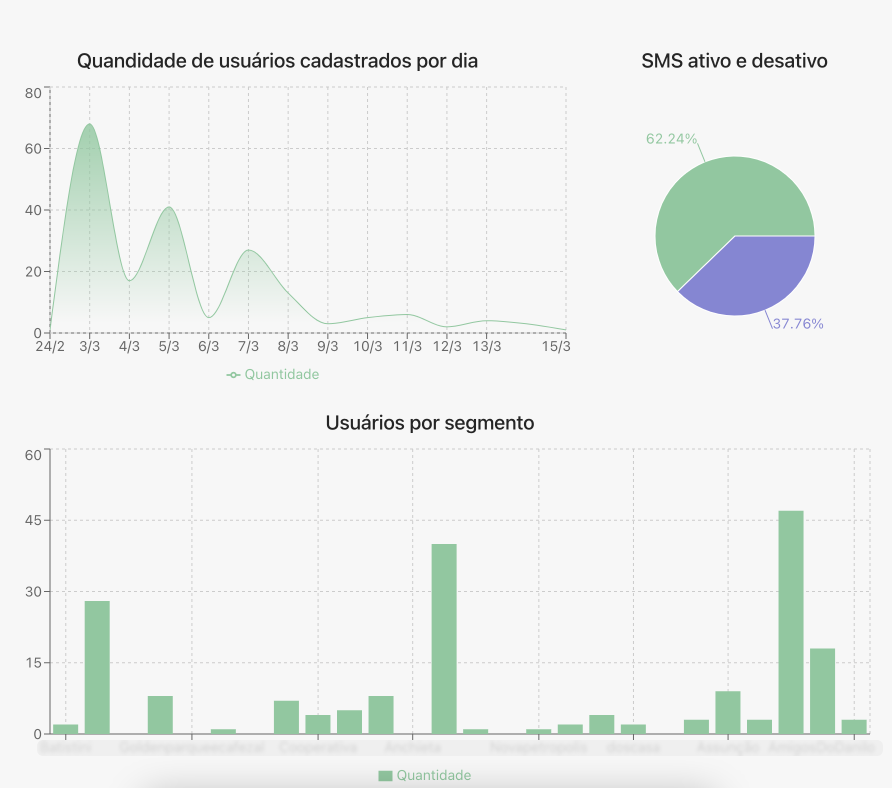
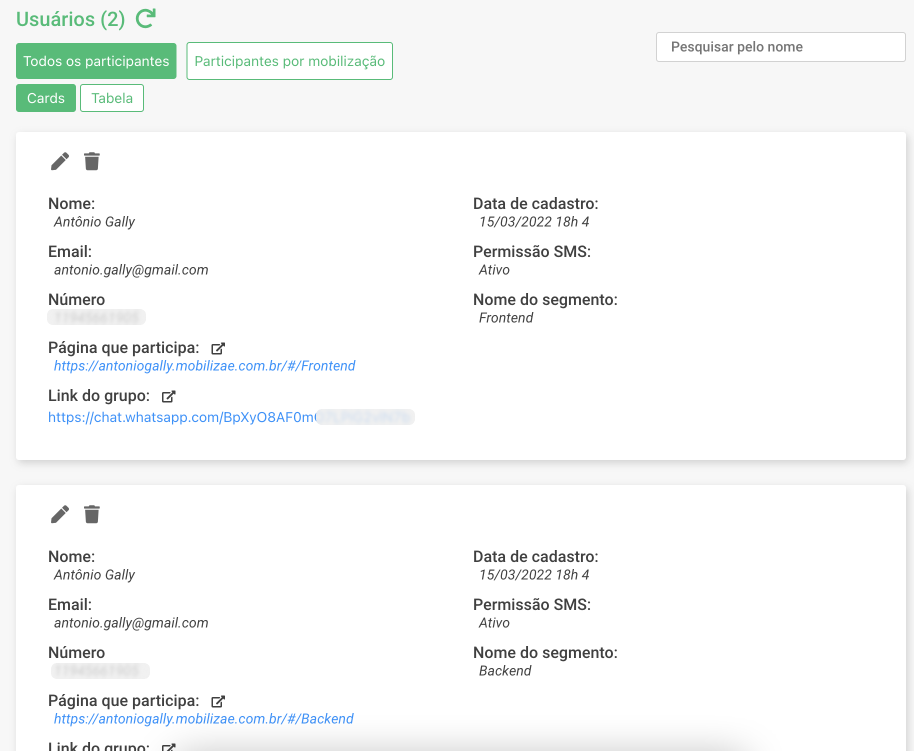
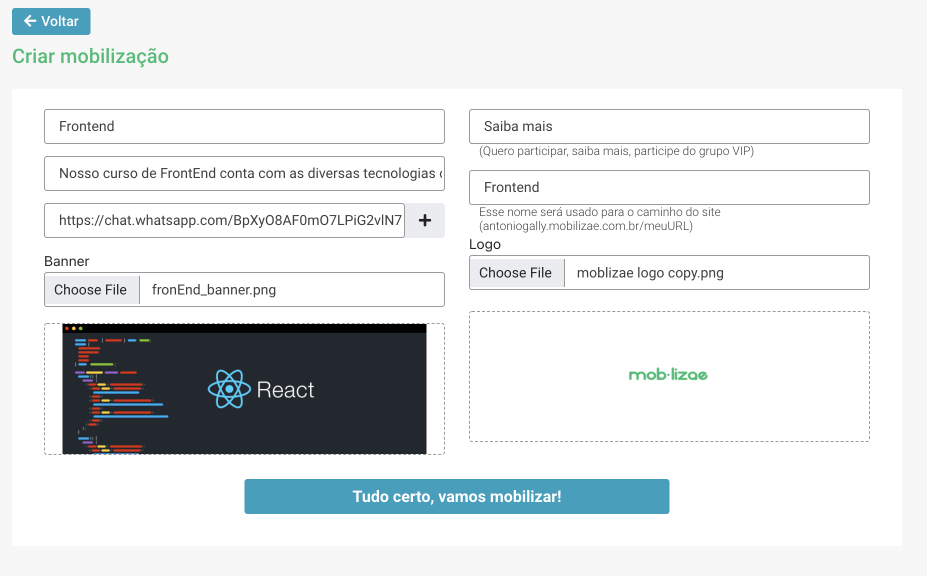
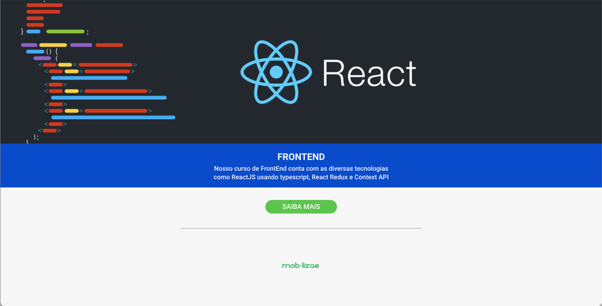

<p align="center">
 
</p>

<h3 align="center">Moblizae</h3>

<div align="center">

[]()
[](https://github.com/AntonioGally/mobilizae-interface/issues)
[](https://github.com/AntonioGally/mobilizae-interface/pulls)
[](/LICENSE)

</div>

---

<p align="center"> This project was built with the goal of segmenting the public <br/>
<a href="https://mobilizae.com.br/">Web site</a>
</p>

## 📝 Table of Contents

- [About](#about)
- [Getting Started](#getting_started)
- [Usage](#usage)
- [Built Using](#built_using)
- [Future](#future)
- [Authors](#authors)

## 🧐 About <a name = "about"></a>

The project started with my brothe's idea of capture some data from different users and organize this data in segments. The capture of the data would need a custom page and for the data visualization, we'll need a platform to show all users and pages data in different ways. I developed one POC using ReactJS and firebase as "backend and DB". It worked until some point, but with a larger number of users, i needed to create our infrastructure using our database and API, and so i did all this alone :c. I learned a lot, i've never worked with backend applications, this was the first project on nodeJS and it was fine, i was able to do all the tasks and requirements. Down here you will find more information about the stacks that i used to build the app.

<p style="width:100%; display: flex; flex-wrap:wrap; justify-content:center; align-items:center">
    
    
    
    

</p>

## 🏁 Getting Started <a name = "getting_started"></a>

These instructions will get you a copy of the project up and running on your local machine for development and testing purposes.
### Prerequisites

```
Node 14
Yarn 1.22
Git bash 2.32
Visual Studio Code
```

### Installing

A step by step series of examples that tell you how to get a development env running.

```
git clone https://github.com/AntonioGally/mobilizae-interface.git
code ./mobilizae-interface
yarn install
yarn start
```
## 🎈 Usage <a name="usage"></a>

<p>
    To use the application, you need to be logged in with a account, if you want to, get in toutch with me :) <a href="mailto:antonio.gally@gmail.com">antonio.gally@gmail.com</a>. When logged in, you will have access to create new pages of yours segments and distribute your pages to your users and see the collected data on the platform.
</p>

## ⛏️ Built Using <a name = "built_using"></a>

- [React JS](https://pt-br.reactjs.org/) - Web framework
- [Node JS](https://nodejs.org/en/) - API framework
- [Netlify](https://www.netlify.com/) - Site host
- [Heroku](https://www.heroku.com/home) - API and DB host
- [MongoDB](https://www.mongodb.com/) - Non-relacional database for my log
- [Amazon S3](https://aws.amazon.com/pt/s3/) - Amazon storage for my images
- [Registro BR](https://registro.br/) - Domain register
- [Google analitycs](https://analytics.google.com/analytics/web/) - Analysis of Google


## ✍️ Authors <a name = "authors"></a>


- [@AntonioGally](https://github.com/AntonioGally) - Project development
